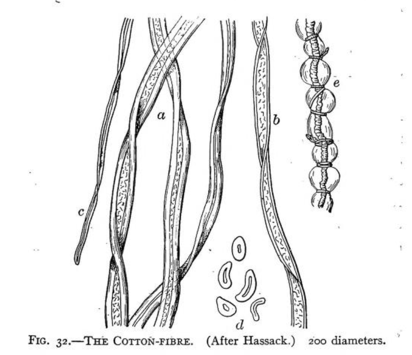

# Materials

## **Wool \(Sheep's\)**

Wool fiber is harvested from sheep and can be obtained in many different grades that make it softer, more brash, etc. for different purposes. Typically, wools with shorter and final staple lengths \(like cashmere or merino\) are carded into woolen yarns for exceptional softness. Longer staple fibers are used for more durable applications. Wool is often noted for its unique "crimped" structure, elasticity, and durability \(in the sense that you can bend the fibers lots and they don't break\). The little crimps or barbs of the wool fiber, make it hold really nicely to other fibers when it is spun into yarn, also making it a bit more durable \(as long as it isn't wet\). Because of these crimps, wool fibers line up in yarn with little pockets of air between them. These little air pockets give it is insulating qualities and heat and cold can't easily move through the contained little air pockets. It is naturally fire resistant \(to some degree\).  Additionally, the cellular makeup of wool makes it particularly good at "wicking" moisture and absorbing it. 

"Wool fibers are made up of cortical cells, and these cells are wrapped in cuticle. This scaly outer layer is then covered by yet another layer, the epicuticle -- a filmy skin that helps to repel moisture. What's more, the epicuticle also helps out in high humidity because it has tiny pores that draw in the moisture vapor to the center of the fiber where it's absorbed by a chemical process. The hydrogen bond of [water](https://science.howstuffworks.com/environmental/earth/geophysics/h2o.htm#pt0), H2O, is actually broken, creating a chemical reaction with the wool fiber molecules to generate heat when it has taken on a lot of moisture. But because the air pockets allow moisture to evaporate from your skin, you won't overheat when you sweat." \[[Source](https://adventure.howstuffworks.com/outdoor-activities/hiking/wool-when-wet2.htm)\]

I have heard that wool can absorb 30% of its weight in water and still remain dry to the touch. This keeps the body cool and dry, and also allows wool to have natural anti-static properties, meaning it won't cling to your skin and, in terms of electronics, won't build up charge.  In my own experiences with thermochromics on fabrics, its thermal properties mean the heat created from my heating wire do not spread far, isolating color change to very specific regions. In some cases, this allows color change to appear on one side of the fabric, and not the other \(for instance\). The elasticity of wool means that it can hold its shape \(or have "memory"\) better than other fibers, as long as it isn't wet.

| General  |
| :--- |
| Staple Length: 70mm \(superfine wool\),   over 50mm typically used for worsted yarns |
| Fiber Diameter: 19 microns \(superfine wool\), 22 microns and over are for worsted yarns |
| Moisture Regain: 13-18% \(but can approach 40% in some conditions\) |
| Elasticity: Good \(pretty springy\) |
| Conductivity: Poor |

| Others  |
| :--- |
| Good Thermal Insulation |
| Fire Resistant |
| UV Resistant |
| Anti-Microbial \(due to moisture wicking\) |
| Moisture Wicking |

| Sustainability |
| :--- |
| Renewable Resource |
| Biodegrades |

[https://www.wool.com/market-intelligence/woolcheque/wool-characteristics/](https://www.wool.com/market-intelligence/woolcheque/wool-characteristics/)

[https://solitudewool.com/pages/types-of-wool](https://solitudewool.com/pages/types-of-wool)

[http://www.fao.org/natural-fibres-2009/about/15-natural-fibres/en/\#:~:text=Silk%3A%20It's%20filament%20is%20a,highly%20prized%20%22natural%20shimmer%22.](http://www.fao.org/natural-fibres-2009/about/15-natural-fibres/en/#:~:text=Silk%3A%20It's%20filament%20is%20a,highly%20prized%20%22natural%20shimmer%22.)

### 

### Silk

Silk is a protein fiber that is harvested from the cocoons of silk worms. There are many varieties of silk depending on the species, diet, etc. of the worm that spun the cocoon. The two main kinds of silk are "mulberry" and "tussah" silk. Mulberry silk comes from the domesticated species "bombyx mori” and is a bit finer and of higher quality as it comes from a very specific breed of worm whose diet consists only of mulberry leaves. Tussah silk comes from a variety of species who live wild largely in South Asia. The general structure of wool \(the cross-section\) is roughly triangular will curved corners. This allows it to reflect light well and gives it a really nice sheen. 

| General  |
| :--- |
| Staple Length: 500-1500m \(super long!\) |
| Fiber Diameter: 10-13 microns |
| Moisture Regain: 11%  |
| Elasticity: Poor \(stays stretched when stretched\) |
| Conductivity: Poor |

| Others  |
| :--- |
| Very Strong |
| Weakened with Sunlight Exposure \(and UV more broadly?\) |
| Light Emissive Properties Help Keep Body Cool |
| Susceptible to Static |
| Demonstrated Piezoelectric Properties |
| Takes on Dye Really Well with Brilliant Colors |
| Chlorine Bleach will Destroy Silk |
| Sweat will Turn Silk Yellow |
| Moisture Wicking  |
| Low Heat Retention |

| Sustainability |
| :--- |
| Renewable Resource |
| Long Lasting \(without direct sun exposure\) |
| Some benefits to Tussah, Which can be harvested without killing the worms.  |

[https://en.wikipedia.org/wiki/Silk](https://en.wikipedia.org/wiki/Silk)

[https://sewport.com/fabrics-directory/silk-fabric](https://sewport.com/fabrics-directory/silk-fabric)

### Cotton

| General  |
| :--- |
| Staple Length: 10-65mm |
| Fiber Diameter: 11-22 microns |
| Moisture Regain: 8.5%  |
| Elasticity: Not Great |
| Conductivity: Poor? |

| Others  |
| :--- |
| Absorbs Moisture |
| Strength Maintained During Washing \(stronger when wet\) |
| Most Commonly Used Fiber in Textiles |
| Low Static |

| Sustainability |
| :--- |
| Renewable Resource |
| Biodegradable  |
| Often Chemically Processed |
| The Plant is Water Intense and Hard on Soil |

### Linen

| General  |
| :--- |
| Staple Length: 25-150 mm |
| Fiber Diameter: 12-16 microns |
| Moisture Regain: 12%  |
| Elasticity: Not Great |
| Conductivity: OK |

### 

### Lyocell \(Tencel\)

### Rayon

### Nylon

### Acrylic

### Polyester

### Stainless Steel

### Silver 

### Gold

### Copper

