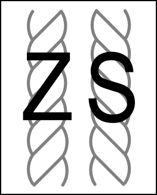

# Plying

Plying consists of twisting multiple singles together. You can make cores and core-spun yarns using plying, but you cannot make hollow structures. You can ply with 2, 3, or however the hell many yarns you like, but its probably best to stay on the small side \(under 6\) to keep structure if you are doing this somewhat freehand. 

Plying is most often used to make a yarn "balanced." Meaning that the yarn contains twists in two directions that hold it a steady structure.  Thus, plying yarns must occur in the opposite direction that they were spun. The twist of yarns is described as "Z-twist" or "S-twist" and it is a measure relative to your own body. 

If you want to ply yarns together, here is what you do. Each of the singles strands is already contains a twist \(lets say Z-twist\) in one direction. Align all your singles so they are oriented in the same direction \(all Z-twist\) and then join them together by twisting them together in the opposite direction \(the S-direction\). If plying already plied yarns, add twist in one direction  to each strand independently and then, starting from their shared end, twist them in the opposite direction to allow them to form onto each-other. 

| Structure | Ability to be Plied |
| :--- | :--- |
| Raw Fiber | no, needs to be in the form of singles first |
| Filament | yes |
| Roving & Top | yes?, for a more open and loose structure  |
| Singles | yes |
| Plied Yarn | yes |
| Braided Rope | yes \(I don't see why not?\) |
| Knits | yes for tubular knits or narrow flat knits |
| Woven | yes for narrow, flat, or tubular weaves |
| Non-Wovens | yes, if sliced or rolled into thin long pieces |
| Solid Objects | yes, often if integrated as a core and plied around |

## Historical Connections

Sections of the transatlantic cable photographed at the Henry Ford Museum

I was lucky enough to be able to see one of the original pieces of the transatlantic cable at Henry Ford Museum. I couldn't help by love that this cable, this massive innovation moment, was just coils on coils on oils of wire and cable, spun just like yarn. Sometimes we need to look back in order to find ideas for the future and I like to see this as an example of the ways that "smart textile" structures and concepts have been embedded within our society long before the present moment. 

