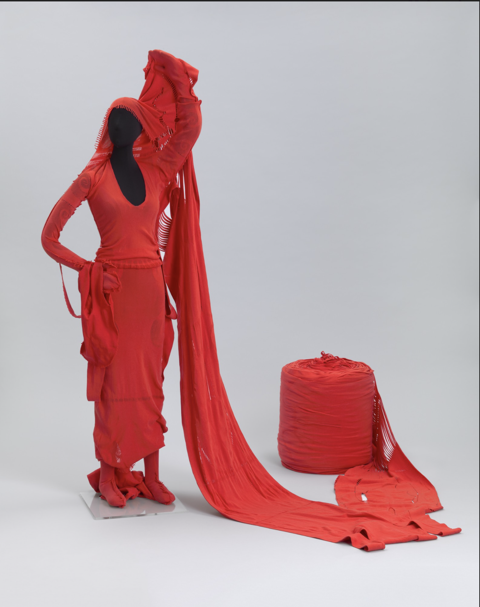

# Knit

A knit is a textile structure created by a series of interconnecting loops. These interconnecting loops create a textile with the ability to stretch in all directions. Knitting uses a continuous filament of material. Depending on the shape of the loops and the material used, the knit textile can have different amounts of stretch. Knitting allows for the construction of shapes without textile waste. One works with different patterns, structures, increasing and decreasing stitches to create shape. In this section, we will mainly focus on hand knitting, although some properties of machine knitting will be covered. In hand knitting, there are two main stitches, knit and purl, which make up two main types of knitted textile patterns, Garter and Stockinette.

## Why Learn about Knitting

## How Knit Fabrics are Produced

// // Hand knitting

// // Table top knitting - 

// // Machine knitting - flat, circular, v-bed

How to Knot

## How to Hand Knit

### **Selecting Yarn and Needle Size**

//techniques for modifyinig drape an dhand

### Primary Stitches

Knit

Purl

### Common Structures and their Properties

**Garter Stitch**: When all stitches are either knit or purl

**Stockinette**: When rows alternate between knit and purl

**Others?**

### **Useful techniques for integrating non-standard materials?**

**Which materials?** Pick the ones that bend well and like to bend a lot. 

### **Knitting in Three Dimensions**

There are many different types of stitches and structures in knitting. But I want to focus on the techniques used to create volume: increasing and decreasing stitches. Stitches can be added at any time during the knitting process, and in varying amounts in order to change the shape of the textile. Decreasing at similar or increased rates creates three dimensional volume. 

## **Describing Knits** 

making and reading patterns.   

## How to Machine Knit

//not sure we'll need this but might be useful to describe at a high level

### 

###  ****

### \*\*\*\*

  
****

  
  
****  
   

