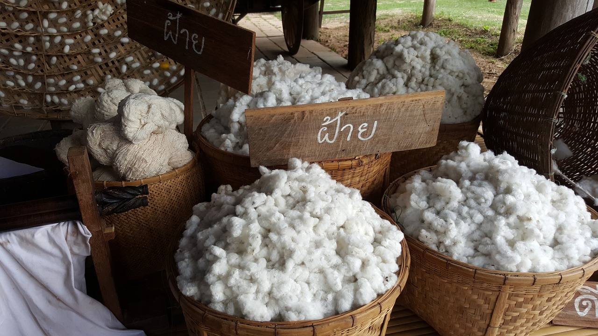

# Staple Fiber

A fiber is one of primary building blocks of textiles, it describe a material with a high length to width ratio. A staple fiber has a limited length while [filaments](filament.md) have unlimited length. Some staple fibers are harvested from animals \(sheep, goats, alpaca\), insects \(spiders, caterpillars\), and plants \(linen, cotton, etc\). Others fibers are produced synthetically through the [extru](../process/extruding-3d-printing.md)s[ion](../process/extruding-3d-printing.md) of solutions containing metals or polymers. Extruded staple fibers are often made from cutting filaments. Staple fibers are [prepared](../process/combing-and-carding.md) and [given twist](../process/spinning/) to turn them into yarns. In other cases, they are entangled directly to make [fabric](../process/felting.md), without passing through the yarn state. When made into yarn, their structure \(lots of little fibers tangled in a row\) often provides them with the ability to hold air and stretch. As such, yarns made from staple fibers may feel softer and springier than yarns made from a continuous filaments. 

### **Primary Measurements**

* **type:** the source of the fiber
* **staple length:** the length of the fiber, measured in mm
* **fiber diameter:** the cross-sectional diameter of the fiber, measured in µm
* **crimp:** the overall shape of the fiber, some have kinks and crimps

