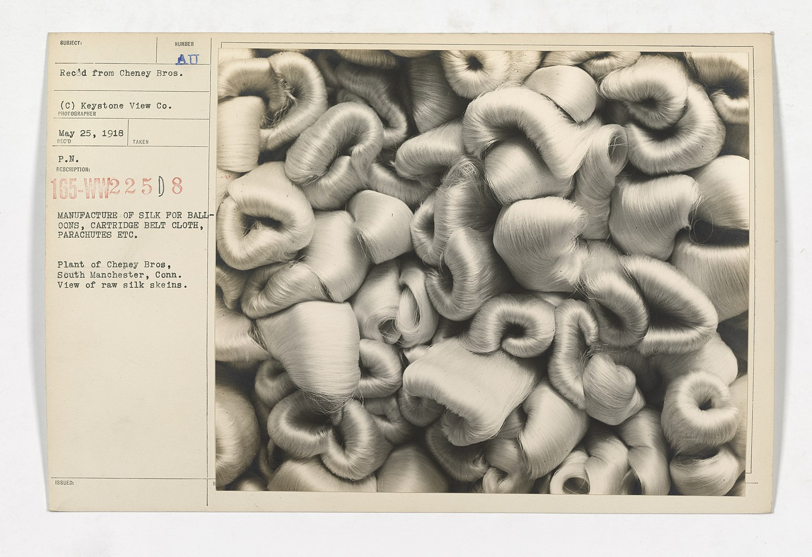
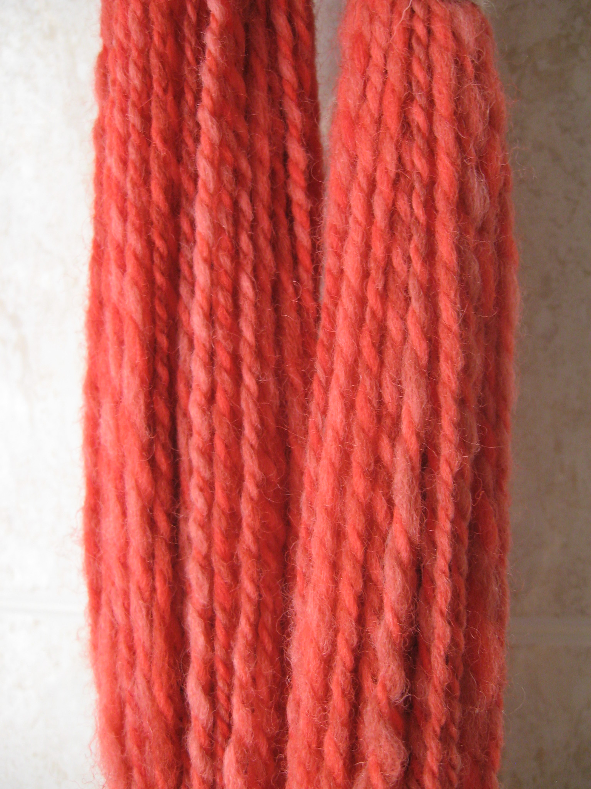
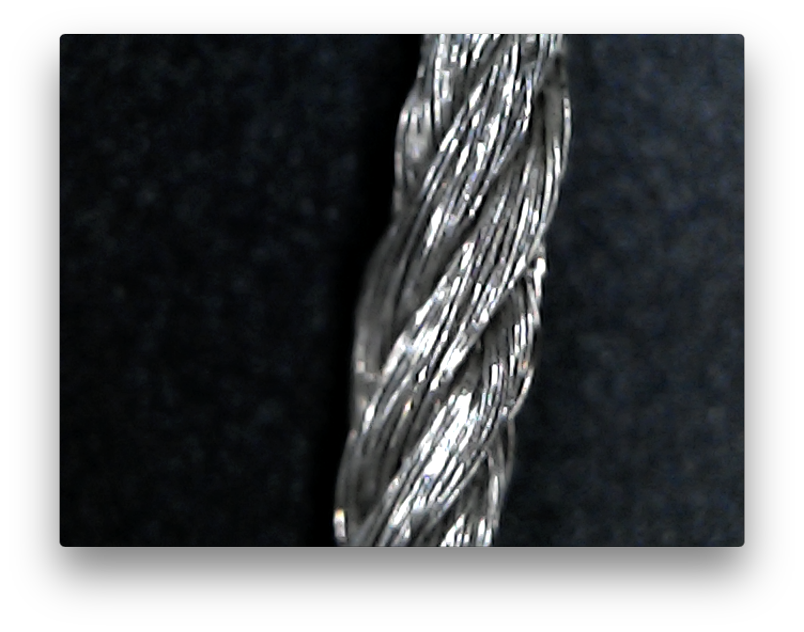
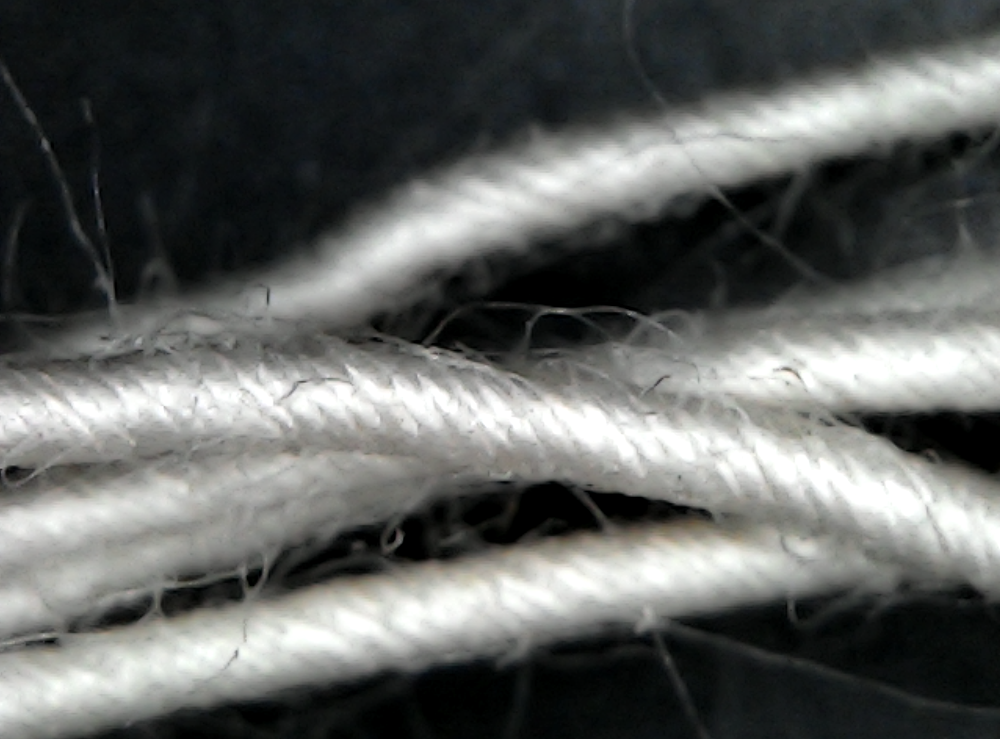
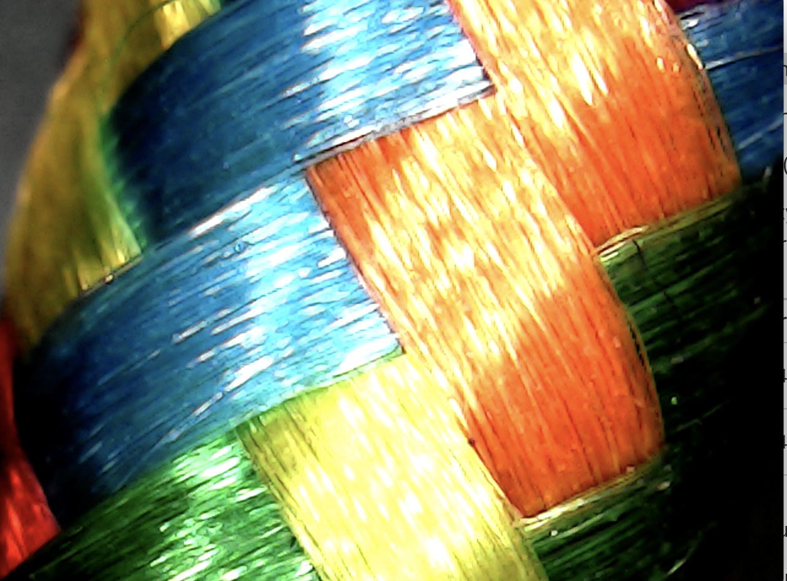
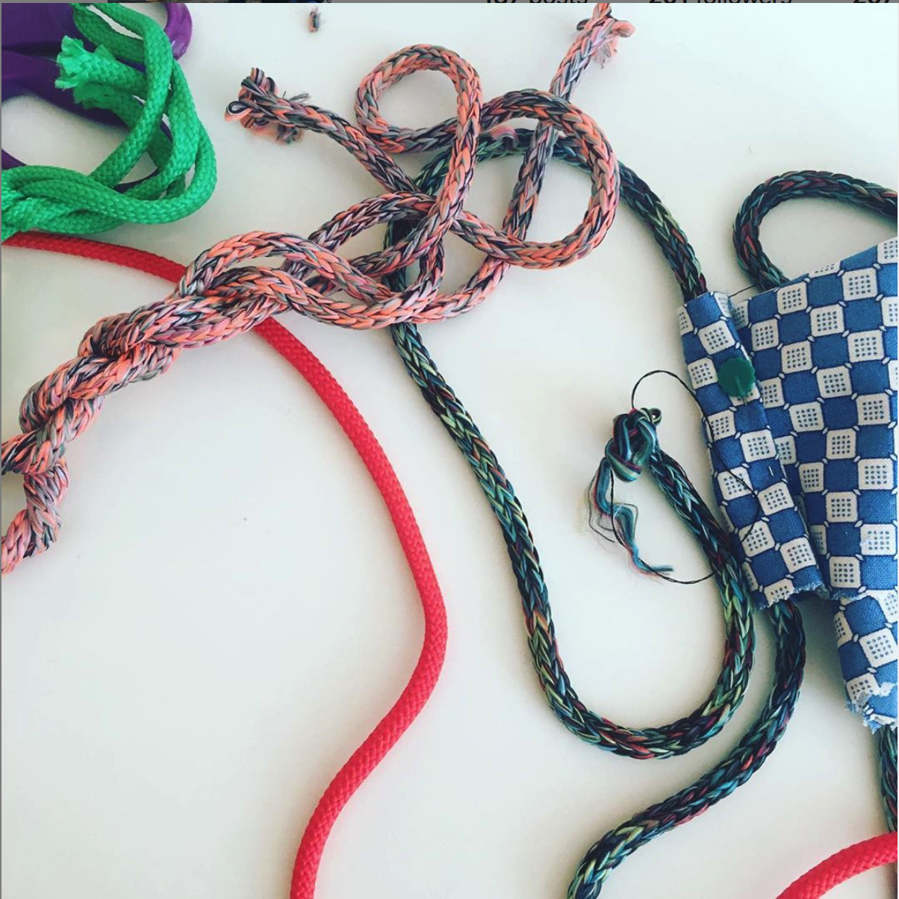
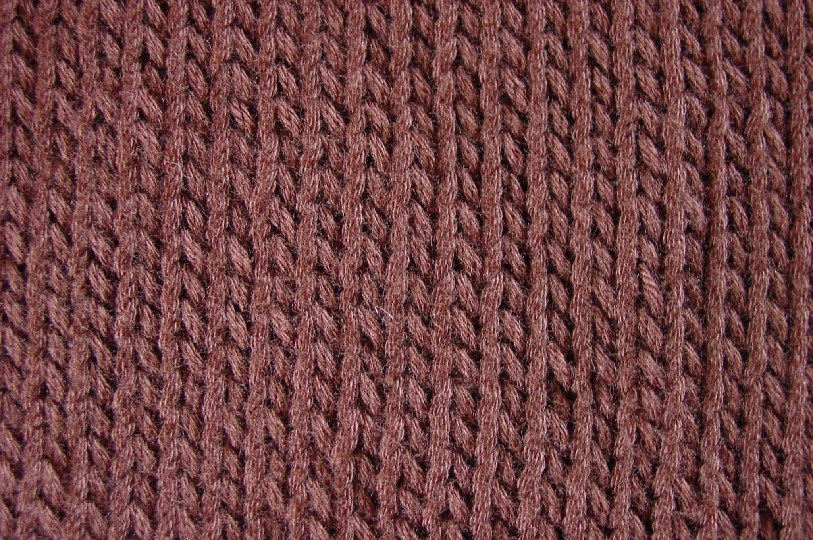
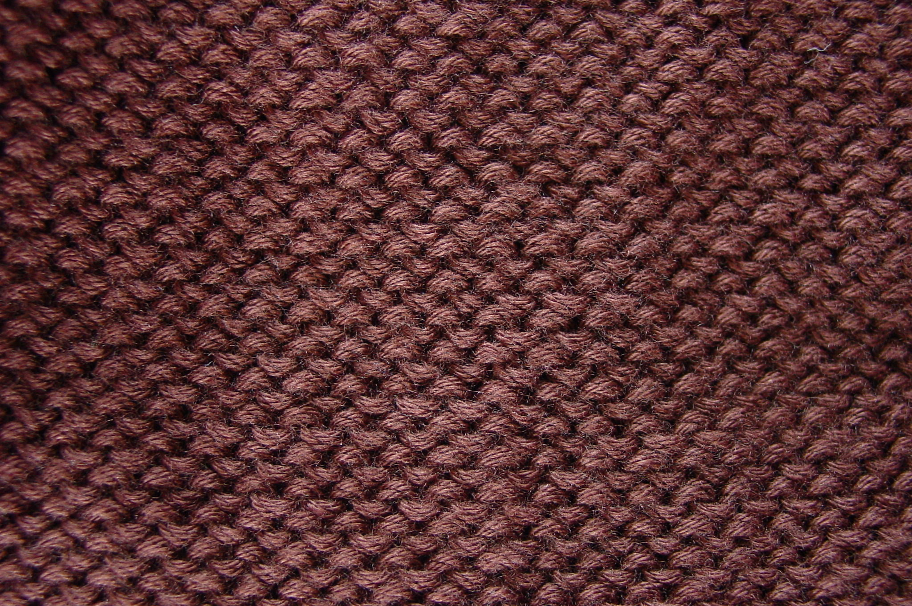

# Structures

## Staple **Fiber**

Staple fiber is the name given to one of the primary structures of textile, a material with a high length to width ratio. Some staple fibers are harvested from animals \(sheep, goats, alpaca\), insects \(spiders, caterpillars\), and plants \(linen, cotton, etc\). Others fibers are produced synthetically through the [extrusion](processes.md#extruding) of solutions containing metals or polymers.

### **Primary Measurements**

* **type:** the source of the fiber
* **staple length:** the length of the fiber, measured in mm
* **fiber diameter:** the cross-sectional diameter of the fiber, measured in µm
* **crimp:** the overall shape of the fiber, some have kinks and crimps

## **Filament**

A filament is a fiber of unlimited or very long length. Filaments are typically produced through [extrusion](processes.md#extruding), are of uniform length and quality. _\*\*_Silk is said to be a natural filament because it can be harvested in single lengths that are very long. Other common filaments include copper magnet wire, nylon, and rayon.

### **Primary Measurements**

* **type:** the source of the filament
* **fiber diameter:** the cross-sectional diameter of the fiber, measured in µm or [AWG](https://en.wikipedia.org/wiki/American_wire_gauge)

  filaments are available as monofilaments or multifilaments. Monofilaments refer to a single continuous length of filament where multifilaments consist of several filaments [twisted](processes.md#plying) or [braided](processes.md#braiding) together.

## **Roving and Top**

Roving and or Top describe fibers that have been given and initial structure to hold them together, but have not yet been given any twist. These are produced by processes of [combing or carding](processes.md#combing-and-carding) individual fibers into into a common direction prior to [spinning](processes.md#spinning). Typically, [carding](processes.md#combing-and-carding) fibers entangling them in multiple directions \(think a dreadlock\). Collections of fibers prepared in this fashion referred to as "woolen" and sold under the name **roving**. Thus, roving adds a springy and airy quality to a yarn when it is spun. Alternatively, some fibers are prepared through combing \(like a pony tail\) which aligns the individual fibers in a single direction and often removes fibers of unusual length. Fibers prepared by [combing](processes.md#combing-and-carding) are called "worsted" and sold as **top**. Worsted preparations tend to produce stronger and denser yarns when they are spun.

There are several products sold on the market such as "[carbon roving](https://www.compositeshop.de/xoshop/lng/en/fibers/carbon-fiber/carbon-roving-tenax-sts40-24k.html)" or "[glass roving](https://www.compositeshop.de/xoshop/lng/en/fibers/carbon-fiber/glass-roving-vetrotex-ec14-2400tex-p185.html)" that describe strands of continuous filaments laying mostly parallel to each other. These are structurally very different than roving made from staple fibers but share the quality of being the preparation before twist is added.

### **Primary Measurements**

**type:** the plant or breed of the combed/carded fiber  
**staple length**: the average staple length of the fibers within the roving \(when applicable\)  
**yield**: the number of yards of roving per pound.

_because roving and top can easily be pulled to cut or twisted back into their structure, the length of the roving/top itself is less important. It assumes people will pull off the amount of roving/top they need at any given time._

## **Singles**

Singles are produced when roving or top are twisted in the process of [spinning](processes.md#spinning), turning into a longer yarn-like structure. All yarns are created through one or more singles together, in a process called [plying](processes.md#plying) which adds additional structure and texture to yarn.

### **Primary Measurements**

* **twists per inch:** the amount of twist applied to create the singles \(can also be expressed as a twist angle\). 
* **wraps per inch:** a measure of the width of the single calculated by winding around a one inch length at a neutral tension. 
* **denier:** describes the mass of a singles for a given length. Specifically, the number of grams per 9000 meters. a single strand of silk has a denier of 1, meaning that higher deniers carry more mass than silk and lower deniers are finer than silk. Anything with a denier less than than one is typically referred to as being made of "microfiber"

## **Plied Yarn**

The yarn or thread that you purchase for projects just as knitting, sewing or weaving is plied meaning that it has been created through a process of [plying](processes.md#plying) several [singles](structures.md#singles) yarns and/or [filaments](structures.md#filament) together. A 2-ply yarn is made of 2 singles, a 3-ply is made of three singles and so on. In some cases, yarns that have already been plied together can then be plied together another time to create "cabled" yarn structures. So, to make a yarn with 4 plys, one has the option to either ply four singles together at once or make 2, 2-ply yarns and later ply them again into a single 4-ply yarn. The first is called 4-ply, the second 2x2ply. The cabled yarns will be more durable than the 4-ply yarns.

You can find another description of plied structures [here](https://www.thesprucecrafts.com/what-is-plied-yarn-2116148#:~:text=Plies%20are%20the%20individual%20strands,doesn%27t%20make%20much%20sense.) and a description of [cabling](https://knitty.com/ISSUEdf10/KSFEATdf10glossary.php) [here](https://knitty.com/ISSUEdf10/KSFEATdf10glossary.php).

### **Primary Measurements**

Note, yarns tend to be described differently by their suppliers and the application that they intend for the yarn to be used within. However, any yarn can be used for any application.

* **wraps per inch:** A measure of yarn width calculated as the number of wraps of the yarn that can fit within an inch at a neutral tension. You can find a demonstration [here](https://www.youtube.com/watch?v=G4MuKCCNoCk).
* **gauge \(knitting\)**: A measurement of yarn weight oriented towards knitting: [https://www.craftyarncouncil.com/standards/yarn-weight-system](https://www.craftyarncouncil.com/standards/yarn-weight-system)
* **ratios \(weaving\)**: weaving yarns are sold with measurements describing the weight of the yarn and number of plys within the structure. This includes measures like 20/2 Cotton or 10/2 tencel. The numerator describes the weight of the yarn, with _higher_ numbers indicating _finer_ weight. The denominator describes the number of plys:[ https://spinoffmagazine.com/yarn-numbers-mean-weaving-yarns/](https://spinoffmagazine.com/yarn-numbers-mean-weaving-yarns/)
* **ratios \(Conductive Yarns/Filaments\):** Some sellers of conductive yarns also follow this convention, only their numbers are a bit more wild like [117/17 Silver 2-ply](https://www.shieldextrading.net/products/yarns-threads/) or something wild. [Kobakant](https://www.kobakant.at/DIY/?p=379) helped me understand this by noting that the numerator indicates the Denier, the denominator is the number of _filaments_, and the 2-ply describes the number of plies. According to [Shieldex](https://www.shieldextrading.net/products/yarns-threads/), the denier applies to only one of the plies, meaning that the actual weight would need to be multiplied by 2.  I can't say I totally understand this but for the product above, I would guess it means that 17 filaments make up each "ply" within the two ply structure \(meaning the total number of filaments in the thread overall is 34. This is the weight prior to being coated with silver.  I still find this so confusing and it seems to shift by retailer. 
* **cross-sectional width \(Conductive Yarns/Filaments\):** To add another hitch to our measuring questions, sometimes resellers will describe their yarns/wires in terms of the diameter in microns or expressed as [AWG](https://en.wikipedia.org/wiki/American_wire_gauge), which is a measure that corresponds to the diameter of a cross-section of the wire but is wacky in that it scales logarithmically. The rule of thumb for me, using copper, is that the higher the number the thinner the wire. 40 AWG copper is about as thin as my hair and breaks easily. Something between 36-28 AWG has been the ideal for textile work as it is relatively strong yet also very thin and workable into the textile structure.
* **linear resistance \(conductive materials\):** conductive materials can also be described by their linear resistance which is the amount of resistance \(in Ohms\) per unit length. This measure depends on the material and construction and will also vary with the amount of force applied to the yarn. As [Anita Vogl very well explains in her talk comparing different structures for conductive stretch sensors](https://www.youtube.com/watch?v=AdM6I8fYB3E) \(@ 2:00minutes\). She gives and explanation of  how staple fibers will lower resistance when stretched because the air between fibers will be condensed, putting the fibers into closer contact and creating more pathways for electricity to flow.  \__\*\*_\_Filament based yarns become narrower when pulled, creating smaller cross-sectional width and, therefore, will raise resistance on stretching. 

## **Core Spun Yarns**

Core spun yarns describe a multi-layered yarn structure where fiber is spun around a single continuous filament in the core. This is a common technique for creating conductive yarns. The internal material is referred to as the core, and the outer is referred to as the sheath. There is a seemingly endless combination and set of techniques for constructing core spun yarns, which you can find [here](https://www.sciencedirect.com/topics/engineering/core-spun-yarn).

## **Braid**

A braid is a structure that is created by interlacing singles, plied yarns and/or filaments in a flat, but more often, tubular structure. The most noticeable difference between a plied structure and a braided one is that the braid requires materials to travel in two directions around a center point. A tubular braid is a hollow structure and can be left hollow for particular applications and has particularly good mechanical properties for [artificial muscles](https://softroboticstoolkit.com/book/pneumatic-artificial-muscles). These are created because, with slippery materials, the braid will increase its cross-sectional diameter when compressed, and narrow when stretched \(a tubular scissor linkage\).

Yet, we often find braiding as a method of adding strength around a core, for instance, in the creation of climbing rope or as a decorative "shell" for a mundane appliance cord. The advantage to braiding is that it makes it slightly easier to combine several different materials \(e.g. conductive and non-conductive materials\) as you have a bit more control over tension within braiding than you do with spinning.

Braiding can be performed with in spun yarn, filament, or even more complex structures such as knitted cord, as I found when I was disassembling some old shoelaces:

### Primary Measurements:

Because of the multitude of factors that can be used in a braid, I do not know of any standard measurement across all applications. Measurements of braided rope or cord express the measurements of the various components involved. For instance, I found this set of measurements for parachute cord online:

Diameter of approximately 4.0mm \(5/32”\)  
7 - 2 ply cabled inner nylon strands  
Nylon 32 strand woven outer sheath

This tells me inside of the braid there are 7 individual nylon strands each having a 2-ply structure. I'm assuming that 32 individual strands of nylon are then used to braid the outer sheath.

## **Knits**

A knit is a textile structure created by arranging material \(most often [plied yarn](structures.md#plied-yarn) and[ filaments](structures.md#filament)\) into a series of interconnecting loops. These interconnecting loops can create a flat-\(ish\) textile with the ability to stretch in all directions as well as tubular or flat circular structures that strength along their length and width. The amount of stretch for a given knit depends on the materials, density, and stitches used. A stitch describes a specific combination of yarn manipulations in the fabrication process that imbue the knit with a particular structure \([we cover this more in our process section](processes.md#knitting)\).

Knitting is.often used for the creation of soft and stretchy textile items such as sweaters, blankets, plush toys as well as athletic garments or other garments that require a skin-tight fit.

Choices of material, stitch and density can vary across the surface of a knitted structure, allowing different regions of a single textile to display different mechanical properties. This allows for some materials to be integrated into portions or regions of the knit, etc. Additionally, one can knit with a single material or two materials in tandem, for instance, if they want to pull from a material like wool and a thin material like copper at once while their knitting, joining them in the structure without the need to ply.

Knitting allows for the construction of shapes without textile waste. One works with different patterns, structures, increasing and decreasing stitches to create shape. The structure of knits varies by the stitches used in their production, which make the knit more or less stretchy, more or less open in various regions of the overall structure.

The knotted nature of knits means that the materials used in knitting tend to be very flexible with a high bending radius. The inherent stretchiness of the knit structure means that materials integrated into a knit structure need to maintain their ability to stretch to avoid breaking.

Knits are described by the materials, equipment \(e.g. needle size\) and stitches used expressed in the form of [knitting patterns](documenting.md#knitting).

**Knit Structure Inspirations:**

* Jenny Sabin: Lumen, an architectural scale machine knit project [https://www.jennysabin.com/lumen](https://www.jennysabin.com/lumen)
* Irene Posch & Ebru Kurbak: Knitted Radio [http://www.ireneposch.net/the-knitted-radio/](http://www.ireneposch.net/the-knitted-radio/)
* Issey Myaki APOC Zero-Waste Knits [https://collection.cooperhewitt.org/objects/18698063/](https://collection.cooperhewitt.org/objects/18698063/)
* Beam Contrechoc Tiny Knittings [http://etextile-summercamp.org/swatch-exchange/tiny-knittings/](http://etextile-summercamp.org/swatch-exchange/tiny-knittings/)
* Borre Knit Design Studio [https://byborre.com/pages/byborre-studio](https://byborre.com/pages/byborre-studio)

## Wovens

A woven textile structure is created by interlacing material \(most often [plied yarn](structures.md#plied-yarn) and[ filaments](structures.md#filament)\) in two directions: the _warp_ \(threads running along the length\), and _weft_ \(threads running along the width\). These structures are created by stretching or "warping" a set of parallel yarns \(or radical yarns in circular weaving\), and then interweaving the weft yarns in a perpendicular direction to bind the textile together. The specific patterning of "overs" and "unders" gives the woven textile different thicknesses, ability to sheer, and durability, etc.

Because of their durability and less stretchy structure, woven fabrics are commonly used in upholstery, demin, and tailored garments like suits. They are also used in industrial applications to create composite materials or abrasion resistant pads or architectural materials \(e.g. wire meshes, etc\).

Woven structures are not inherently as stretchy as knits and the structure of weaving equipment makes working with stretchy materials challenging. Yet, like knitting, woven structure can be varied across the surface of a fabric giving rise to materials that have different mechanical properties in various regions.

One of the strengths of weaving is its ability to easily create multi-layered structures, where multiple layers and interlacements of layers can be woven at one time. This allows for pockets and tubes to be easily embedded into the structure of a woven fabric, a technique that is often used for the creation of quilted fabrics but can also be used for multi-layered woven circuits.

Because woven tend not to be stretchy and require less knotting or looping of materials \(in most cases\), weaving is often preferable for brittle materials or materials that do not bend well. Furthermore, the process of weaving makes it easy to integrate a wide variety of materials with a wide variety of widths into the structure, creating interesting textures and methods for integrating "hard" materials into their soft structure.

Wovens are described by the materials, equipment \(e.g. needle size\) and stitches used expressed in the form of [weaving patterns](documenting.md#wovens).

## Non-Wovens

Non-wovens describe a class of textile structures that does involve the use of fiber or its processing into yarn. Instead, non-wovens are textile-like materials that are created by other processes of extruding \(e.g. chainmail or 3D printed textiles\), growing \(such as leather or kombucha\), felting, a process by which individual fibers are tangled so much as to form a durable surface or structure, or electrospinning, where fibers are bonded into a fabric through electrical charge. These structures range in properties. Grown, felted, and electrospun materials are often not structurally stretchy, as they are relatively uniform and solid structures.

The method of describing or measuring a non-woven would vary by the material.

## Textile Friendly Structures & Objects

While we have covered a series of possible structure that accumulate to build textiles, there are an almost infinite amount of variations and things that can be added that change the quality of a textile that we did not cover.

Any long thing material \(especially pliable\) material can be used as a textile material and integrated into braids, knits, and wovens. This includes materials like rubber tubing, paper strips, chainlink, materials that can be rolled or torn into long lengths like old blankets and rags, or even vines.

Furthermore, any material that lends itself to being threaded can be used in a textile. For instance, materials like sequins, beads, or other fabrics can be threaded onto a yarn prior to braiding, knitting or weaving, giving an additional set of textures. The through-holes on an Arduino can be threaded through by a conductive yarn to bind the hardware onto the surface \(or within the structure\) of a knitted or woven material.

Other solid materials can be integrated into the core of core-spun yarns, including fragments of wood, small ball bearings, magnets, etc.

