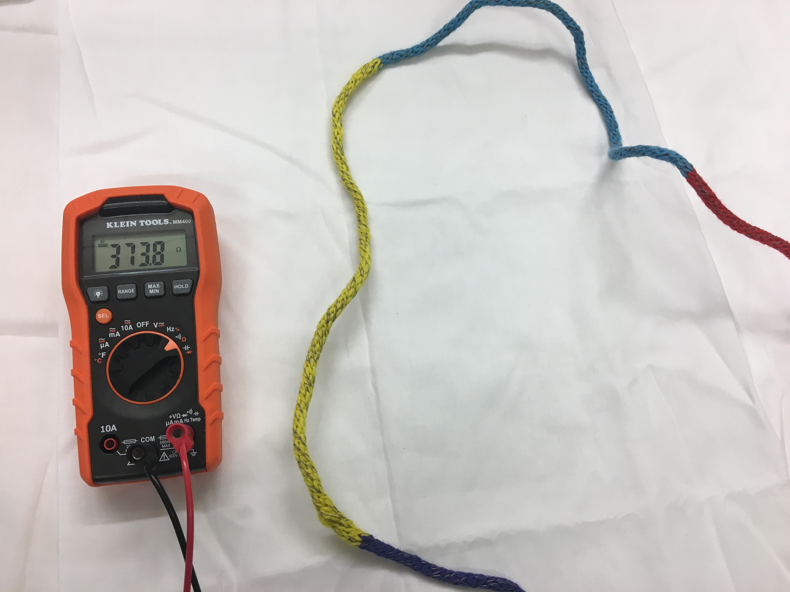

# Application: A String that Knows its Shape

In one project, we used conductive materials in the core AND the sheath to create a string that would know something of its own shape. It did so by adding five different insulated conductive wires inside the structure. Each insulated wire was then attached to a exposed conductive "ring" made of copper tape. This allowed us to take resistance measurements at five different points along the length. Depending on which sensors showed changes in resistance and which didn't, we could tell which regions of the string were crossed.

 



